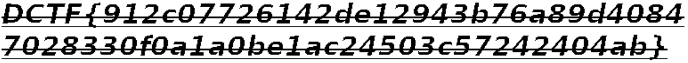

# DefCamp CTF 2018: EagleEye
***Category: Stego***
>*Do you see it?*
## Solution
For this challenge, we are given an image, [chall.png](chall.png).

This challenge is a pretty simple stego challenge. If you open the file in `StegSolve` and switch to the gray bits plane, the [flag](solve.png) can be found in the top left corner.

***Flag: `DCTF{912c07726142de12943b76a89d40847028330f0a1a0be1ac24503c57242404ab}`***
