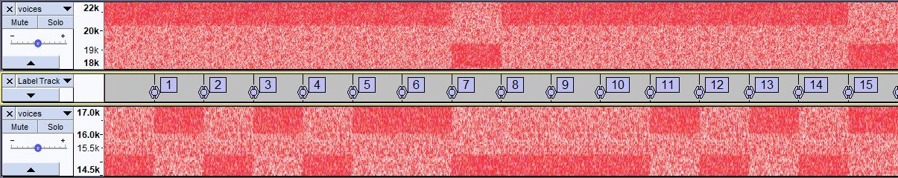

# DefCamp CTF 2018: Voices
***Category: Misc***
>*Listen. Can you hear the voices? They are there. Somehow. *
## Solution
For this challenge, we are given an an audio file, [voices.wav](voices.wav).

I begin by opening the file in Audacity, but it seems to be just static. Nothing much we can do with that. So next we check the spectrogram. At first glance, there seems to be nothing there either. However, if we zoom out on the frequency range, we start to see some strange patterns.

Upon further inspection, the strange patterns seem to be two sets of binary. I make a few quick adjustments to help make it a tiny bit easier to read.

Now for the fun part: transcribing the binary string. Fast forward about 15 minutes and we get:
```
11111110 11111110 10001010 10111010 10011011 10011011 10101011 10111011 10111010 10101011 10101010 10101010 10111010 10101010 10111011 10111010 10111001 10111011 10111011 10111010 10101010 10011011 10101010 10101011 10111011 10111010 10101010 10101010 10111011 10111011 10111011 10111010 10101011 10101010 10101001
01010110 00010101 00100110 10111001 10110110 10110100 10001010 10111001 10010111 10001000 10110111 10001010 10111000 01110111 01000100 01011000 01001010 10010100 10000100 10011011 10010101 10111011 01011010 10001000 10100101 01010111 10111011 10010101 01001010 01010101 10001000 01000110 01111011 01010111 01010000
```
I thought it was strange that it gave us two sets of binary rather than one long string, so I started thinking of ways we could use both sets of binary together. I knew we were getting close because if flag is in the standard flag format of `DCTF{sha256digest}`, the flag had to be 70 bytes long, and the two strings were a total of 560 bits, or 70 bytes. I also knew the first five bytes would be `01000100 01000011 01010100 01000110 01111011`, which is the binary representation of `DCTF{`. So we start looking for ways to make `01000011` with `11111110` and `01010110`. A couple hundred attempts later, we find this:
```python
>>> ''.join([''.join(x) for x in zip('11111110','01010110')])
'1011101110111100'
```
If we zip `11111110` and `01010110`, we get `1011101110111100`. Why does this matter? `DC` in binary is `0100010001000011`! The flag is the two binary strings zipped together and XORed with 255! So we write a quick script to decode the rest:
```python
str1 = '1111111011111110100010101011101010011011100110111010101110111011101110101010101110101010101010101011101010101010101110111011101010111001101110111011101110111010101010101001101110101010101010111011101110111010101010101010101010111011101110111011101110111010101010111010101010101001'
str2 = '0101011000010101001001101011100110110110101101001000101010111001100101111000100010110111100010101011100001110111010001000101100001001010100101001000010010011011100101011011101101011010100010001010010101010111101110111001010101001010010101011000100001000110011110110101011101010000'

flag = ''
flip = lambda x: '0' if x == '1' else '1'
for a,b in zip(str1,str2):
	flag += flip(a) + flip(b)

print format(int(flag, 2), 'x').decode('hex')
```
And out comes the flag.

***Flag: `DCTF{c068a8e71044b752b7307bbeed7e94e5e426f80f3751ddb226fe1dd55ecb0fbf}`***
